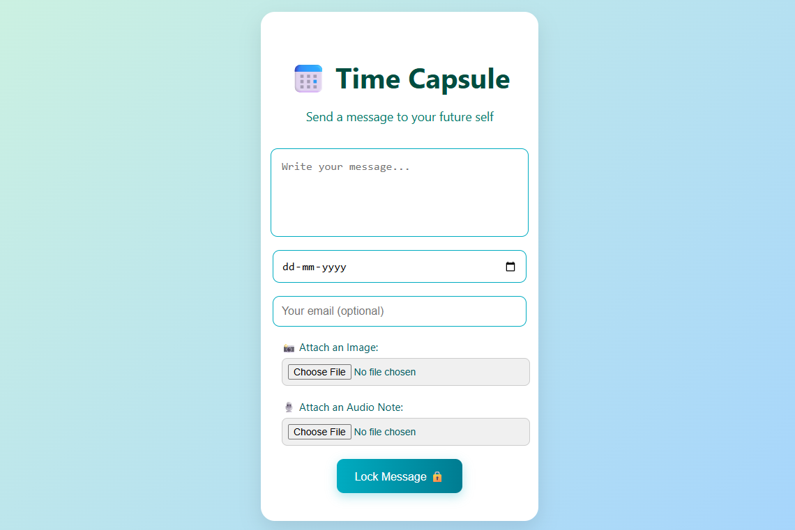
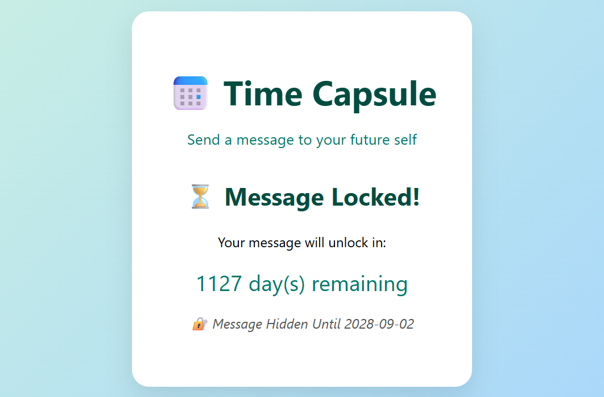

# ⏳ Time Capsule - React App

Send a message, an image, or an audio note to your **future self**!  
Just set a future date, write your message, attach media, and lock it away.

## Features

- Write messages to your future self
- Set an unlock date
- Attach an image
- Attach an audio note
- Receive it by email (on unlock date)


## Live Demo

🌐 [Visit Time Capsule App](https://time-capsule-react-app.netlify.app/)


## App Screenshots

<table>
  <tr>
    <td align="center"><strong> Message Input Page</strong></td>
    <td align="center"><strong> Locked Message Page</strong></td>
  </tr>
  <tr>
    <td></td>
    <td></td>
  </tr>
</table>


## Built With

- React
- Vite or Create React App
- CSS / Chakra UI (if used)

## Getting Started

```bash
git clone https://github.com/Vasantha-Meghana/Time_Capsule_React_App.git
cd Time_Capsule_React_App
npm install
npm start
```
